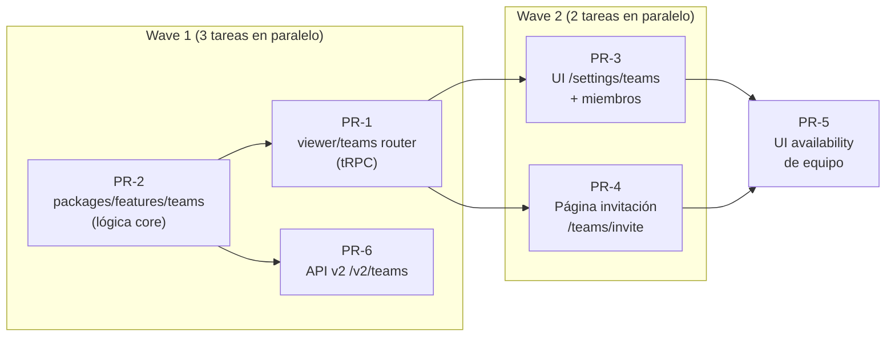

# Plan: Feature de Equipos (Teams) — Cal.diy

> Creado: 2026-10-08 · Base: fork Cal.com v6.2.0 (imágenes `jorgeortega593/calcom-cal.dy:6.2.0`)
> Meta: usuarios se unen a equipos, y cualquier miembro puede crear/editar bookings
> y availability **del equipo** además de los personales.

---

## 1. Objetivo

1. Un usuario puede crear equipos y/o unirse por invitación.
2. Al crear un event type, booking o availability, en el dropdown donde hoy aparece
   solo el nombre del usuario, también aparecen los equipos a los que pertenece.
3. Los miembros del equipo ven y editan los bookings y la availability del equipo
   según su rol (`OWNER` > `ADMIN` > `MEMBER`).
4. API (tRPC interno + API v2 pública) expone todo esto de forma coherente.

**NO es una organización.** Las organizaciones (dominio custom, SAML, contenedor
de varios equipos, billing) quedan explícitamente fuera de alcance. Solo equipos:
un Team con `parentId: null` y `Membership` con roles.

---

## 2. Estado actual del fork (verificado en repo)

### 2.1 Ya existe (heredado de Cal.com — NO hay que escribirlo)

| Capa | Evidencia |
|---|---|
| Esquema BD completo | `packages/prisma/schema.prisma`: `Team` (L557), `Membership` con roles (L744), `EventType.teamId` (L180), `Booking.teamId`, availability con `teamId` (L1175) |
| Scheduling de equipo | `EventType.schedulingType` (COLLECTIVE/ROUND_ROBIN/MANAGED) ya implementado en el flujo de booking |
| Confirm/handlers con teamId | `packages/trpc/server/routers/viewer/bookings/confirm.handler.ts:444` |
| Availability de equipo (backend) | `packages/trpc/server/routers/viewer/availability/team/listTeamAvailability.handler.ts` |
| Dropdown usuario/equipo (backend) | `CreateEventTypeDialog.tsx:66` ya recibe `profileOptions` con `teamId` |
| Listado por equipos | `packages/features/eventtypes/lib/getEventTypesByViewer.ts` agrupa por `membership.team` |
| Redirección legacy | `apps/web/next.config.ts:539` ya redirige `/settings/teams` → `/teams` |

### 2.2 Fue eliminado por el fork (TODO el trabajo)

1. **Router tRPC `viewer/teams`**: CRUD de equipos, invitaciones, miembros/roles,
   availability compartida, aceptar invitación.
2. **`packages/features/ee/`**: el fork lo borró entero; ahí vivía la lógica de
   teams (acoplada a organizaciones). Hay que recrear SOLO la parte de equipos.
3. **UI de equipos**: página `/settings/teams`, settings del equipo (miembros,
   roles, appearance, availability), página `/teams/invite/[id]`.
4. **API v2 `/v2/teams`** en `apps/api/v2`.

**Cero migraciones de BD**: el schema ya está desplegado en las imágenes 6.2.0.

---

### 2.3 Página pública de agendamiento del equipo (descubierto al verificar slugs)

Los slugs de equipo apuntan a URLs `/team/...` que **este fork no sirve**:

- `next.config.ts:335` tiene rewrites hacia `/team/:slug` (p. ej. `/org/:slug` → `/team/:slug`), pero no existe la página/vista que responda en esa ruta (la vista de perfil de equipo fue eliminada con el resto de UI de equipos).
- `getTeamEventType(teamSlug, meetingSlug, orgSlug)` (`packages/features/eventtypes/lib/getTeamEventType.ts`) quedó huérfana: era el resolver de la página de booking de equipo.
- El `Booker` en sí (`packages/features/bookings`) sí sabe renderizar eventos de equipo (usa `getPublicEvent`, que ya devuelve `teamId`, logo, etc.).

→ El port añade un **PR-7**: página pública `/team/[slug]` (listado de event types del equipo) + `/team/[slug]/[type]` (booker), ~300–500 líneas, depende de PR-3. Ver sección 5.

## 3. Estrategia

Port desde upstream Cal.com v6.2.0 (github.com/calcom/cal.com), **desacoplando
equipos de organizaciones/EE**. No se diseña desde cero: se restaura y se adapta
a las divergencias del fork (imports, flags EE, helpers eliminados).

Reglas aplicables (AGENTS.md): PRs <500 líneas / <10 archivos, draft PRs,
`yarn type-check:ci --force` antes de push, `ErrorWithCode` fuera de tRPC,
`select` en Prisma, strings en `packages/i18n/locales/en/common.json`.

---

## 4. Entorno de prueba

**Ya existe y es el correcto**: `docker-compose.dev.yml` (raíz) levanta
Postgres :5433 + Redis :6380 + web con **hot reload** (bind mount del repo +
`next dev --turbopack`). Todo lo que editemos en `packages/*` y `apps/web`
recompila al guardar — ese compose compila las características que estamos
editando, no usa imágenes pre-construidas.

En este plan se **añade la API v2** al mismo compose (NestJS con `--watch`,
bind mount igual que la web) para poder probar el PR de API v2.

```bash
docker compose -f docker-compose.dev.yml up -d
# Web:  http://localhost:3000   (hot reload)
# API:  http://localhost:3002   (hot reload, swagger en /docs)
# Logs: docker compose -f docker-compose.dev.yml logs -f web api
```

Primera vez tarda (instala dependencias dentro del contenedor). Volúmenes
nombrados para `node_modules` porque los bind mounts de Windows son lentos.

### Flujo de verificación manual (por PR y final)

1. Crear 2–3 usuarios de prueba en la web :3000.
2. Usuario A crea equipo → invita a B y C por link.
3. B/C aceptan invitación → aparecen en miembros del equipo.
4. A/B crean un event type de equipo (dropdown: equipo en vez de usuario).
5. B crea availability del equipo; A la ve.
6. Un booker externo reserva el event type del equipo; A y B ven el booking
   en la lista de bookings; ambos pueden editarlo según rol.

---

## 5. PRs y paralelización



`PR-2` define los servicios/interfaces; `PR-1` y `PR-6` los consumen, por eso
los tres van en la misma wave con el **contrato acordado por adelantado**
(sección 6). `PR-6` es independiente del tRPC: solo depende del contrato.

| PR | Contenido | Tamaño est. | Depende de |
|---|---|---|---|
| **PR-2** | `packages/features/teams/`: servicios de teams (crear, invitar, roles, availability), port de la parte no-org de upstream `ee/teams/lib` | ~500–800 | — |
| **PR-1** | `packages/trpc/server/routers/viewer/teams/` + montaje en `_router.tsx`: CRUD, `inviteLink`, aceptar invitación, perfiles de equipo | ~600–900 | PR-2 (contrato) |
| **PR-6** | `apps/api/v2`: restaurar el controller de `GET /v2/teams/{teamId}/event-types`. **Hallazgo**: `TeamsEventTypesService.getTeamEventTypes(teamId)` (L122) y `OutputTeamEventTypesResponsePipe` ya existen huérfanos (su controller fue eliminado); el PR es reconstruir la ruta, no reescribir la lógica | ~250–400 | PR-2 (contrato) |
| **PR-3** | UI `/settings/teams`: lista/crear equipos, página del equipo (miembros, roles, appearance), entrada en nav/kbar | ~800–1200 | PR-1 |
| **PR-4** | Página `/teams/invite/[id]` + flujo de aceptar (signup si no tiene cuenta) | ~300 | PR-1 |
| **PR-5** | UI availability de equipo en settings (port de `team-schedule` UI de upstream) | ~400–600 | PR-3, PR-4 |
| **PR-7** | Página pública de agendamiento: `/team/[slug]` + `/team/[slug]/[type]` (usa `getTeamEventType` que ya existe) | ~300–500 | PR-3 |

### Cómo se paraleliza en la práctica

- **Wave 1**: 3 subagentes concurrentes con el contrato del PR-2 congelado en
  el contexto compartido. `PR-2` y `PR-1` los escribe el mismo agente o dos con
  interfaces fijadas (`TeamsService`, `PermissionService` checks `team.read` /
  `team.create` / `invitation.accept`).
- **Wave 2**: 2 subagentes tras merged PR-1 (UI y página de invitación tocan
  archivos distintos: `modules/settings` vs `modules/teams`).
- **Wave 3**: 1 subagente (PR-5 depende de que exista la página del equipo).

---

## 6. Contrato técnico (congelado antes de Wave 1)

### Rutas tRPC (namespace `viewer.teams`)

```
teams.list                      // equipos del usuario actual (+rol)
teams.get({ teamId })
teams.create({ name, slug, logo, ... })
teams.update({ teamId, ... })   // OWNER/ADMIN
teams.delete({ teamId })        // OWNER
teams.inviteLink.create({ teamId })   // solo OWNER/ADMIN
teams.inviteLink.get({ teamId })
teams.inviteLink.delete({ teamId })
teams.inviteMembershipByLink({ inviteLink })  // público, sin sesión previa
teams.setMembershipRole({ teamId, memberId, role })  // OWNER/ADMIN
teams.removeMembership({ teamId, memberId })
teams.leaveTeam({ teamId })
teams.getMembers({ teamId })    // select sin credential.key
teams.getUpgradeable...         // NO portar (es de orgs/EE)
```

### API v2

```
GET/POST   /v2/teams
GET/PATCH/DELETE /v2/teams/{teamId}
GET/POST   /v2/teams/{teamId}/members
PATCH/DELETE /v2/teams/{teamId}/members/{memberId}
```

### Permisos (reutilizar `PermissionCheckService` si existe en el fork,
si no crear en `packages/features/teams`)

| Acción | OWNER | ADMIN | MEMBER |
|---|---|---|---|
| Editar settings del equipo | ✅ | ✅ | ❌ |
| Gestionar miembros/roles | ✅ | ✅ | ❌ |
| Crear/editar event types del equipo | ✅ | ✅ | ✅ |
| Editar availability del equipo | ✅ | ✅ | ✅ |
| Ver/renombrar bookings del equipo | ✅ | ✅ | ✅ |
| Borrar equipo | ✅ | ❌ | ❌ |

### Decouplado orgs

Del port de upstream se EXCLUYE: `organizationSettings`, billing/stripe,
`isOrganization` flows, dominios custom, `parentId` en la UI. Si un archivo
upstream mezcla ambas, se copia recortando org.

---

## 7. Verificación por PR

- `yarn type-check:ci --force` (obligatorio, no confiar en que CI falla por otras causas).
- `yarn biome check --write .` en archivos tocados.
- `TZ=UTC yarn test` en paquetes tocados.
- Smoke en `docker-compose.dev.yml`: ejercitar la ruta cambiada en la web real
  (ver flujo de verificación, sección 4).
- PRs con UI: strings nuevos van a `packages/i18n/locales/en/common.json`.

---

## 8. Riesgos

| Riesgo | Mitigación |
|---|---|
| Fork divergió de upstream 6.2.0: imports/helpers rotos al portar | Cada PR parte de grep del símbolo en el fork; `xd://lsp` para referencias antes de mover exports |
| Código upstream acoplado a organizaciones | Recorte explícito (sección 6, "Decouplado orgs") |
| Windows + bind mount lento en dev | Volúmenes nombrados ya resueltos en `docker-compose.dev.yml` |
| PR de UI crece >500 líneas | Se subdivide nav + lista vs página interna |
| Scheduler/dropdown no aparece si `profileOptions` no incluye equipos | PR-3 verifica la fuente de `profileOptions` (viene de `viewer.me` / memberships) |

---

## 9. Criterio de "hecho" (end-to-end)

1. Los 6 PRs merged (o rama única si se decide así).
2. Flujo de la sección 4 completo, grabado/evidenciado contra
   `docker-compose.dev.yml`.
3. `yarn type-check:ci --force` verde en la punta de la rama.
4. API v2 swagger documenta `/v2/teams`.
5. Sin migraciones pendientes; schema intacto.
